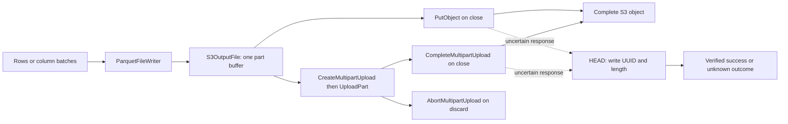

# S3 Output Files

Proposed end-state design for [#1454](https://github.com/hardwood-hq/hardwood/issues/1454).
The source analysis, unresolved contract decisions, and delivery checklist are in
[_plans/S3_OUTPUT.md](../_plans/S3_OUTPUT.md). This document specifies the proposed
behavior; it does not describe an implemented backend.

Related documents:

- [S3_STORAGE.md](S3_STORAGE.md): transport, signing, credentials, and input files
- [WRITER.md](WRITER.md): forward-only output and writer failure handling
- [EXCEPTION_MODEL.md](EXCEPTION_MODEL.md): exception categories
- [TESTING.md](../TESTING.md): s3proxy integration-test environments

## Purpose and boundaries

`ParquetFileWriter` writes to an S3 object through the existing `OutputFile`
interface. Output is streamed in order without a local staging file. Small outputs
use one `PutObject`; larger outputs use sequential multipart upload. The destination
contains a complete object only after publication, never an incomplete Parquet
prefix assembled from the parts uploaded so far.

The backend belongs to `hardwood-s3`. Its production dependencies remain the core
module and the JDK. Authentication, endpoint configuration, HTTP-client ownership,
and signature generation remain on the existing S3 stack.

This feature includes the library factory and configuration, upload protocol,
per-output write identification, metadata verification after uncertain publication,
failure handling, documentation, and integration coverage. CLI output destinations,
parallel part upload, parallel encoding, resumable uploads, automatic region
discovery, object-version management, and bucket creation are separate capabilities.
The caller supplies an existing bucket and keeps the `S3Source` usable until the
writer finishes or is discarded.

## Components and API

| Component | Responsibility |
|---|---|
| `S3Source` | Own configuration and shared transport; create uncreated output files |
| `dev.hardwood.s3.internal.S3OutputFile` | Own one output's buffer, byte offset, write UUID, upload ID, part receipts, verification, and lifecycle |
| `S3Api` | Construct, sign, send, and validate S3 REST operations, including object metadata HEAD requests |
| Internal multipart XML helper | Serialize part receipts and validate bounded XML responses |
| Internal bounded response handler | Bound write-response memory and complete only after the response body is received |
| `ParquetFileWriter` | Produce Parquet bytes, finish the footer, and choose publication or discard |

The public surface is:

| Member | Return type |
|---|---|
| `S3Source.outputFile(String bucket, String key)` | `OutputFile` |
| `S3Source.outputFile(String uri)` | `OutputFile` |
| `S3Source.Builder.uploadPartSize(int bytes)` | `S3Source.Builder` |

Both factory overloads return the existing `OutputFile` type; multipart machinery
and upload receipts do not become public API. Factories perform no network I/O.
The URI overload uses the existing `s3://bucket/key` parsing path. Bucket and key
must be non-null and non-empty; the URI must identify both. Keys are opaque object
names, including spaces, Unicode, `+`, `%`, `?`, `#`, repeated `/`, and `..`.
They are encoded per segment, without path normalization or interpreting key
characters as query parameters.

`uploadPartSize` defaults to 8 MiB. It applies to outputs created by that source,
not to input ranges, Parquet pages, or row-group targets. The supported range is
5 MiB through `Integer.MAX_VALUE - 8` bytes, reflecting the contiguous Java-array
buffer. An out-of-range value fails with `IllegalArgumentException` before a client
or output resource is allocated. A configured size is a memory budget for each
active output, so multiple outputs each retain their own buffer.

An output does not close the source's HTTP client. `S3Source.close()` retains its
existing distinction between an owned client and a caller-supplied client.
`RangeBacking` and the read-side sparse cache have no role in output buffering.

### Write identity

`create()` generates a fresh random UUID for this output. The UUID stays the same
through its part retries and publication verification. A new output receives a
new UUID even when it targets the same bucket and key. Writers generate IDs
independently using the JDK; no central counter or registry is required, and random
UUID collisions are negligibly likely.

Store the UUID in the signed `x-amz-meta-hardwood-write-id` header on the small-file
`PutObject` or the initial `CreateMultipartUpload`. For multipart output, S3 carries
that metadata onto the completed object; it is not attached separately to each
part or added at completion. The header name is reserved for the backend and is
not a caller-configurable option. The ID is object metadata, not a Parquet footer
field, and does not change the file's bytes or schema.

The ID attributes a completed object to an output attempt. It is not a lock or
an S3 upload ID. It does not prevent another writer from replacing the object.
The factory uses the caller's chosen key without adding the UUID to its filename.

## Data flow



1. The writer validates its schema and configuration before calling `create()`.
2. `create()` allocates local output state and a part buffer and generates the write
   UUID. It creates no S3 object and no multipart upload.
3. `write(ByteBuffer)` copies the buffer's remaining bytes into the part buffer,
   preserving their order. A call can fill many parts.
4. On the first full part, initiate multipart upload, retain the returned upload
   ID, and upload part 1. Subsequent full parts use consecutive numbers.
5. Each upload finishes before the buffer is cleared or reused. Record its ETag
   only after validating the successful response.
6. The writer flushes its last row group, Bloom filters, page indexes, and footer
   through the same sink. Their bytes can cross any part boundary.
7. `close()` publishes the small buffered output or uploads the final non-empty
   part and completes the multipart upload.
8. If the final response cannot establish publication, check object metadata within
   a bounded verification budget. Matching write UUID and length confirm success;
   otherwise report that publication could not be confirmed after verification.

Multipart parts are transport units. They need not align with pages, column
chunks, row groups, the footer, or the boundaries of `write` calls.

## Buffering, position, and limits

`write` operates on the caller's current position and limit. Heap buffers, slices
with non-zero array offsets, direct buffers, and read-only buffers are supported.
On success the input is consumed up to its limit, without changing the limit.
No caller-owned buffer is retained after the call returns. An empty write does
nothing and does not initiate an upload.

The logical position is a `long`: bytes accepted into the local buffer count even
before they are sent. It is not the number of acknowledged remote bytes. A
successful call advances it by the input's original remaining length. If a call
fails after consuming some bytes, the output is failed and cannot resume, so the
caller must not retry the remainder on that output.

Each output has at most one payload request in flight. The same byte array is
used for the body and any replay of that part. The payload hash and HTTP body
cover only its valid prefix, excluding unused capacity. Clearing the buffer,
overwriting it, and advancing the part number all wait for an acknowledged
success. An exhausted part request fails the output, so its buffer is never
reused for a different payload. Publication verification reads only metadata.

Payload storage is O(part size), not O(file size). The output also keeps at most
10,000 small part receipts and bounded protocol-response buffers. This bound is
additional to memory retained by the writer for row groups, page indexes, Bloom
filters, and footer metadata; it is not a bound on the whole writer's memory.

Current AWS multipart limits are 10,000 parts, numbered 1 through 10,000, and
5 MiB through 5 GiB per part, with no minimum for the final part. The service's
maximum object size is 48.8 TiB. The backend's narrower array limit and fixed
part size determine its own maximum:

```text
maximum output bytes = uploadPartSize * 10,000
```

At the 8 MiB default that is 78.125 GiB. A larger part size raises that limit while
raising the per-output memory requirement. An endpoint may enforce a lower limit.
Validate the entire incoming write against the remaining capacity before consuming
it, using long arithmetic. Exceeding capacity throws `IOException`, fails the
output, and discards its upload; never send part 10,001. The writer's final footer
also counts toward this limit. See [AWS multipart limits](https://docs.aws.amazon.com/AmazonS3/latest/userguide/qfacts.html).

### Boundary behavior

Let `P` be the configured part size and `N` the final output length.

| Length | Requests |
|---|---|
| `0 <= N < P` | One `PutObject` on close; no multipart initialization |
| `N == P` | Initialization and one full part while writing; completion on close |
| `P < N < 2P` | One full part while writing; one short final part and completion on close |
| `N == kP` | Exactly `k` full parts and completion; no empty final part |
| `N == kP + r`, `0 < r < P` | `k` full parts, one final part of `r` bytes, then completion |

A zero-byte raw `OutputFile` is a valid empty S3 object. A Parquet writer with no
records still produces magic bytes and a footer and must read back as a valid
zero-row Parquet file; these are distinct tests.

## Lifecycle

The output is single-use and confined to one calling thread at a time, matching
the writer. Sharing a source among separate outputs is supported; sharing one
output among concurrent writers is not.

| State | Meaning |
|---|---|
| `NEW` | Factory created the output; no resources acquired |
| `OPEN` | Created, writable; upload ID may still be absent |
| `FAILED` | A write or upload failed; no further data is accepted |
| `VERIFYING` | A publication response was uncertain; bounded metadata checks are in progress |
| `COMMITTED` | Publication was acknowledged and validated, or confirmed by matching metadata |
| `DISCARDED` | No publication is permitted; local resources released |
| `PUBLISH_UNKNOWN` | Publication was attempted but its outcome could not be established |

`create()` is allowed only in `NEW`. Calls to `write` and `position` before
creation are rejected with `IllegalStateException`. After failure, further
writes are rejected. After a terminal state, neither writing nor recreation is
permitted. `position()` is available only while open.

`close()` on an open output publishes. `close()` on a failed output discards
instead; it never commits a prefix. `close()` before creation is a no-op.
`discard()` before creation or while open prevents publication and releases any
local state. Repeated `close()` and `discard()` after successful termination
do nothing. In particular, discard after commit does not delete the committed
object, and close after discard does not issue a `PutObject`.

A failed cleanup may retain a known upload ID for another explicit `discard()`
attempt. Repeated `close()` after a publication error does not retry publication.
Metadata verification runs inside the first close, before it returns or throws;
subsequent closes do not restart verification.
The writer's own `close()` is already terminal, so cleanup during that first
close must make its bounded attempt and report any unresolved cleanup failure.

## REST operations

| Operation | Request | Required successful response |
|---|---|---|
| Small-object publication | `PUT /key` | HTTP 200; entire buffered prefix sent |
| Initiate | `POST /key?uploads=` | HTTP 200 with valid `InitiateMultipartUploadResult` and a non-empty `UploadId` |
| Upload part | `PUT /key?partNumber=N&uploadId=ID` | HTTP 200 with a non-empty ETag header |
| Complete | `POST /key?uploadId=ID` | HTTP 200 with a valid `CompleteMultipartUploadResult` and non-empty ETag, not an `Error` document |
| Abort | `DELETE /key?uploadId=ID` | HTTP 204, or HTTP 404 with a parsed `NoSuchUpload` identifying that this upload no longer exists |
| Verify uncertain-part cleanup | `GET /key?uploadId=ID` | HTTP 200 with a valid `ListPartsResult`, or HTTP 404 with a parsed `NoSuchUpload` |
| Verify publication | `HEAD /key` | HTTP 200 with this output's write UUID and the expected Content-Length |

The completion body lists only acknowledged parts, in ascending part-number
order, and includes each ETag exactly as returned. ETags are opaque; do not assume
they are MD5 digests or strip their quotes. XML serialization escapes their
contents. A one-part multipart upload is valid.

Query values use the existing SigV4 percent-encoding rules. Upload IDs are opaque
and may contain `+`, `/`, `=`, and percent characters. Construct and sign the same
URI, preserving the existing object-key encoding. Do not use form URL encoding
where it turns spaces into `+`, or concatenate an unescaped ID into a URI.

Every attempt resolves current credentials and is signed again with a fresh
timestamp. Existing path-style, virtual-hosted, default-port handling, and session
token behavior apply to HEAD, POST, and DELETE as well as GET and PUT. HEAD uses
the empty payload hash and returns headers without downloading object data.

### XML and response validation

Responses are fully consumed before a request succeeds. In particular,
`CompleteMultipartUpload` may send HTTP 200 and whitespace while working, then
finish with an XML error. HTTP status alone is not an acknowledgement. Parse the
complete body and expected root before marking the output committed. See
[AWS completion behavior](https://docs.aws.amazon.com/AmazonS3/latest/API/API_CompleteMultipartUpload.html).

Use the JDK's default StAX implementation with DTD and external-entity processing
disabled. Match element local names so normal S3 namespaces work. Require the
expected root and required fields, reject duplicate required fields and malformed
or truncated XML, and allow unrelated optional response elements. Treat an
`Error` root as an error regardless of the HTTP status. Parser errors are translated
to contextual `IOException` at the S3 boundary, not `ParquetReadException`.

Write-response bodies, including errors, are capped at 256 KiB. A bounded HTTP
body subscriber stops reception at the cap, releases/cancels the response, and
fails the operation. Diagnostics retain a short error code/message and relevant
request identifiers rather than the full unbounded response. Malformed success
responses after an initiation or publication request require the same uncertainty
handling as a lost response.

The configured request timeout covers waiting for the entire response body, not
just receiving headers. Await the body-completing HTTP future with a deadline
and cancel it on timeout. Whitespace keepalives do not extend that deadline.
Backoff occurs outside the per-attempt deadline. The existing timeout option
remains the way a caller accommodates slow uploads or long completion requests.

## Retry policy

Reuse the source's retry count, exponential backoff, jitter, and per-attempt
signing without applying GET's replay policy indiscriminately to writes.

| Operation | Replay policy |
|---|---|
| GET on the existing read path | Preserve existing behavior |
| Upload part | Retry network failures and HTTP 500/503 within the budget, keeping the same upload ID, number, and immutable payload |
| Abort | Retry network failures and HTTP 500/503 within the budget against the same ID |
| Initiate | No automatic replay after an uncertain request; a replay can create another upload |
| Put or complete | No automatic replay in this initial backend; verify metadata after an uncertain response before reporting the outcome |
| HEAD for publication verification | At most `maxRetries + 1` checks, sharing one budget for pending results and transient request failures |

An acknowledged upload part replaces any prior part with that number, so replaying
the same bytes does not append duplicate data. Do not count a retried part twice
or record a receipt before receiving its ETag. See [AWS UploadPart](https://docs.aws.amazon.com/AmazonS3/latest/API/API_UploadPart.html).

For multipart write operations, HTTP 403/404, validation errors, missing ETags,
invalid XML, and missing upload IDs are not retried as transient failures.
A completion error such as
`InvalidPart`, `InvalidPartOrder`, `EntityTooSmall`, or `NoSuchUpload` is a failed
completion; never claim success from the status or retry with missing receipts.
`NoSuchUpload` after a completion attempt is not proof that no object was published.

## Failures, cleanup, and visibility

Before publication, an existing object at the key remains unchanged. A successful
publication replaces it, matching the local backend's replace-on-close behavior.
Writes by other clients to that same key follow the endpoint's object-write and
versioning rules; this backend does not provide compare-and-swap or a lock.

On a write failure, latch the failed state, discard local buffered data, and
attempt to abort any upload whose ID is known. A later close never completes it.
For a failure during close, cleanup happens within the output backend, because
`ParquetFileWriter` delegates publication directly to `out.close()`.

An unrecovered initiating failure, including a runtime exception or an Error,
keeps its original exception type. Abort/cleanup and verification failures are
added as suppressed, not substituted for the primary exception.
When `discard()` itself is the requested action and cleanup fails, it throws
`IOException`. Credential-provider exceptions and other runtime failures also
trigger cleanup when resources have already been acquired; they are not silently
converted to successful writes.

Interruption cancels the current request, fails the output, and remains visible
as `IOException` with the interrupt flag restored. Cleanup must not be silently
skipped because an already-set interrupt flag makes the abort request immediately
fail. A bounded cleanup attempt may temporarily clear that flag and must restore
it in `finally`. If abort also fails, preserve that failure as suppressed.
Interruption remains a failed/cancelled call; do not start or continue metadata
polling to turn cancellation into a successful close. Diagnostics distinguish
verification skipped due to interruption from checks that were attempted.

### Known upload cancellation

With acknowledged sequential requests, no part remains in flight when abort is
sent. A transport timeout or cancellation can nevertheless leave a server-side
part operation running. AWS notes that abort may need repeating in that case.
After an uncertain part request, use a bounded abort-and-`ListParts` cleanup path:
`NoSuchUpload` confirms that the upload is no longer present; if parts remain,
repeat abort within the cleanup budget. A successful response with no listed
parts is not proof that the upload itself has been removed. Follow list-parts
pagination when needed and never infer an empty upload from an incomplete page.
The total cleanup cycle has at most `maxRetries + 1` rounds; inner request retries
share that budget rather than multiplying it. Never wait or retry indefinitely,
and never interpret
an arbitrary 404, 403, or malformed response as successful cleanup. See
[AWS AbortMultipartUpload](https://docs.aws.amazon.com/AmazonS3/latest/API/API_AbortMultipartUpload.html).

An exhausted cleanup budget is reported. After a completion attempt,
`NoSuchUpload` can confirm that no unfinished upload remains while publication
still has an unknown outcome; it cannot establish that the destination is unchanged.
The upload may still require external
cleanup; local memory is released regardless. Cancellation of a request does not
prove cancellation of the operation on the service.

### Uncertain initiation

If S3 creates an upload but the response containing its ID is lost or invalid,
the backend cannot address that upload for abort. It fails without replaying the
initialization and reports that cleanup could not be confirmed. It does not list
and abort every upload for the same key: another writer may own those uploads.
A bucket lifecycle rule for incomplete multipart uploads provides recovery for
this case and for process termination. This backend cannot promise that no pending
upload exists when the service has not returned an identifiable ID.

### Uncertain publication

If `PutObject` or `CompleteMultipartUpload` may have reached S3 but the final
response is lost, malformed, too large, or timed out, the backend enters
`VERIFYING`. Verification happens before attempting to abort a known upload, so
cleanup does not cancel a completion that is still running while it is being
checked. It is used only after the writer has produced its complete file and
attempted publication. A failed batch, filler, codec, or incomplete footer is
never recovered as successful publication through a metadata check.

Issue signed HEAD requests for the exact bucket and key, using the same endpoint
and credential provider. Accept publication only when a successful response has
one unambiguous `x-amz-meta-hardwood-write-id` value equal to this output's UUID
and a valid non-negative long `Content-Length` equal to the final logical output
position. Metadata header names are case-insensitive. A missing, conflicting, or
malformed header must not produce success. Do not substitute file existence,
ETag, modification time, or file size alone for the identity check.

| HEAD result | Action |
|---|---|
| HTTP 200, matching UUID and length | Set `COMMITTED`, release local resources, and return successfully from close; do not abort or delete the object |
| HTTP 200, other/missing UUID or wrong/missing length | Not verified; recheck within the remaining budget |
| HTTP 404 | Not verified; completion may still be running, so recheck within the remaining budget |
| Network failure or HTTP 500/503 | Retry the metadata check within the remaining budget |
| HTTP 403 or another non-transient error | Stop verification as inconclusive; never classify this as a missing object or a failed publication |
| Interruption | Stop verification, preserve interruption, and attempt bounded cleanup where possible |
| Budget exhausted without a match | Set `PUBLISH_UNKNOWN` and report the original publication failure with verification details |

There are at most `maxRetries + 1` HEAD attempts in total. Missing/mismatching
objects and transient transport errors consume the same budget; the helper does
not run a separate full retry loop for each check. Existing backoff and jitter
apply between checks, and the configured request timeout applies to each request.
Normal acknowledged publications issue no HEAD request. No new public recovery
timeout, retry option, or write-ID option is introduced.

AWS S3's metadata reads are strongly consistent after a completed write, but an
earlier completion request may still be running when HEAD executes. Another
writer may also have replaced or deleted our object before the check. These
conditions explain an absent or different ID without proving that our publication
failed. Successful verification establishes that our completed object was current
at the time of HEAD; it does not lock the key against subsequent writes. Other
S3-compatible endpoints must preserve custom metadata and be tested for these
behaviors. See [S3 metadata](https://docs.aws.amazon.com/AmazonS3/latest/userguide/UsingMetadata.html)
and [AWS consistency](https://docs.aws.amazon.com/AmazonS3/latest/userguide/Welcome.html).

UUID plus length is publication attribution, not a full-file checksum. It relies
on the backend assigning a fresh ID to each output and not reusing or copying that
ID for a different write; ordinary byte-integrity checks remain on the signed
upload path. There is no full-file download during verification.

If verification cannot confirm publication, throw `IOException` explicitly
stating that the destination may contain the completed object. Retain the original
publication cause and include the write UUID and whether verification was attempted,
denied, interrupted, or exhausted. Verification failures and abort failures are
suppressed; a recovered close reports success rather than leaking the earlier
transport exception. Cleanup can abort a known unfinished upload, but cannot
retract an already-completed object. `NoSuchUpload` does not change an unverified
publication into a confirmed failure.

The backend never issues an unconditional `DeleteObject` as rollback. It could
delete the object that existed before this output or a newer object written by
another client. An object existing after a failed close, or a later `NoSuchUpload`,
does not identify the winning write. Subsequent close/discard calls do not retry
publication or delete the destination.

These uncertain outcomes need explicit wording in `OutputFile` and the writer
failure documentation before this backend can claim conformance. The existing
absolute wording that any failed close leaves the destination untouched cannot
be guaranteed over a generic S3-compatible endpoint with lost responses. Metadata
verification resolves positive matches; it does not eliminate all unknown outcomes
or recover a lost initialization ID.

### Process termination and bucket configuration

Cleanup requires the process, credentials, and service to remain available.
Process crashes, `kill -9`, or a permanently unreachable endpoint can leave an
upload. An incomplete-upload lifecycle rule is recommended; it is not configured
by Hardwood. A resumed writer must start a new output and upload, not reuse an
old sink or its part buffer.

The caller needs permission to write objects and abort multipart uploads, and
to list parts for cleanup verification after uncertain part requests. Publication
verification requires `s3:GetObject` on the target object for HEAD, normally the
same permission already used by readers. `s3:ListBucket` is not required to read
existing-object metadata, but determines whether a missing key can be reported as
404 rather than 403. A 403 therefore remains inconclusive. Successful uploads
do not require a verification HEAD, so an upload-only credential can publish
normally but may leave an uncertain response unverifiable. No permission preflight
is added to `create()`.

The application or bucket administrator grants these permissions. Hardwood
documents them and accepts the caller's credentials; it does not provision IAM
policies. Local s3proxy credentials do not prove real AWS permissions. See
[HEAD permissions](https://docs.aws.amazon.com/AmazonS3/latest/API/API_HeadObject.html).

Test observability additionally needs permission to list incomplete uploads. Bucket
default encryption and normal service behavior apply; explicit ACL, storage-class,
requester-pays, SSE-C, and Object Lock configuration are not added by this feature.
Do not claim every S3-compatible service implements every AWS-specific policy.

## Validation scenarios

JVM-only tests use the repository's local `HttpServer` pattern or a recording
HTTP client. They exercise protocol failures deterministically. `*IT` tests use
the existing signed s3proxy endpoint with writable filesystem storage. A proxy
over that endpoint can fail a selected operation while forwarding other requests.
Writable test buckets start empty or seed replaceable objects from independent
bytes. They do not register a fixture path through `TestBucket.withObject(Path)`
and then overwrite it: that helper may hard-link the checked-in fixture, so a
server-side overwrite could modify the source file. Incomplete-upload assertions
use a test-only signed `ListMultipartUploads` helper, filter by exact key, and
follow pagination; object absence alone is insufficient.

| Area | Scenarios and assertions |
|---|---|
| Factory | Bucket/key and URI overloads; null/empty/missing-key inputs rejected before requests; creation sends no request |
| Configuration | Default and minimum part size; below-minimum and array-limit rejection; input range-cache settings do not stage output on disk |
| Small output | 0, 1, and `P-1` bytes produce one PUT and no multipart requests; exact bytes read back |
| Part boundaries | `P`, `P+1`, `2P`, `2P+1`; no empty last part, correct lengths and ascending receipts |
| Buffer forms | Heap, non-zero offsets/slices, direct, read-only, empty; position/limit consumption and byte ordering |
| Write shape | Many tiny writes, one write spanning parts, randomized write partitions produce identical bytes |
| Position | Pending bytes included; full parts included exactly once; long offsets beyond 2 GiB do not wrap |
| Limits | Exactly 10,000 parts allowed; next byte rejected before a request; guard arithmetic tested without allocating a maximum-sized file |
| Payload | Final short prefix hash matches its body; retries use identical bytes; buffer is not reused while a request can still read it |
| Signing | GET/HEAD/PUT/POST/DELETE, both address styles, default/non-default ports, session tokens, refreshed credentials on retry; write metadata included in the signed headers |
| URI | Unicode, spaces, `+`, `%`, `?`, `#`, `//`, `..` keys; opaque upload IDs survive encoding and signing |
| XML | Namespace/no namespace, quoted and escaped ETags, optional fields, missing/duplicate required fields, malformed/truncated XML, DTD/entity rejection |
| Completion | Success XML; HTTP 200 plus `Error`; whitespace then success/error; missing result; stalled and oversized bodies |
| Initialization | Definitive rejection; response lost after an upload was created; missing ID; no blind second initialization |
| Part failure | Recovered 500/503 or transport retry, exhausted retries, 403, missing ETag; no completion after failure |
| Cleanup | Successful abort, known `NoSuchUpload`, abort failure suppressed, list-parts verification/pagination, bounded repeats after uncertain parts; absence of an upload does not resolve an uncertain publish |
| Interruption | During upload/backoff/close; bounded cleanup attempted, flag restored, no hang or publish-on-close |
| Lifecycle | Before-create misuse; duplicate create; repeated close/discard; close after discard; write after failure; discard after commit preserves object |
| Write identity | Fresh UUID for each output, stable across its retries; header on PUT/initiation and preserved on completed multipart objects; no Parquet byte or caller-key changes |
| Publication failure | Definitive PUT/complete rejection does not become a successful write; lost responses trigger verification only after complete file production and never cause destructive deletion or publication replay |
| Metadata recovery | Small PUT and multipart completion succeed remotely but lose their responses; matching UUID and length make close succeed; an acknowledged publish issues no HEAD |
| Verification pending | Missing key or old metadata while completion runs; later match succeeds; no match within the shared bounded budget reports unknown outcome |
| Verification mismatch | Older or newer writer's UUID; matching size alone; same UUID with wrong size; missing/duplicate/malformed headers; none confirms success |
| Verification failures | HEAD timeout, 500/503, 403 with upload-only permission, 404, interruption; budget is not multiplied by nested retries, original cause and verification details retained |
| Existing target | Bytes unchanged before commit, replaced after successful commit, preserved on known pre-publication failure |
| Separate writers | Outputs from one or different sources have distinct write UUIDs; multipart upload IDs and buffers remain separate; overwrite between completion and HEAD stays inconclusive; cancellation never targets another upload |
| Writer failure | Strict batch/row/filler failure and codec failure discard; footer/final-part failure discards; no completed prefix |
| Caller abort | Healthy writer and failure in external producer both cancel; close afterward does nothing |
| Record rejection | `tryWriteRow` returns a rejection and later valid rows still publish; strict `writeRow` failure discards |
| Round trip | Small and multi-part valid Parquet, zero rows, multiple row groups, both writer APIs, footer crossing a part boundary, read through `S3InputFile` |
| Visibility | New key absent before the publication request; existing key unchanged while parts upload; publication can become visible before its response arrives; no pending upload after successful known-ID cleanup |
| Ownership | Output termination does not close the source/client; another output or read from that source remains usable |

The s3proxy ITs prove actual upload interoperability and read-back. Scripted
protocol tests prove behaviors that s3proxy may not emit, especially HTTP 200
errors, lost responses, timeout races, and invalid XML. No test substitutes a
local file copy for the bytes uploaded by the new backend.

## Documentation contract

Public factory and configuration documentation belongs under `docs/content/`:

- A how-to guide writes directly to S3 and reads the produced file back.
- The S3 reference lists output factories, part size, size/memory limits,
  supported endpoint behavior, request/retry and metadata-verification semantics,
  the reserved write-ID metadata field, and required permissions.
- The writer reference, write model, write-failure guide, and `OutputFile`
  Markdown JavaDoc accurately distinguish known failures from uncertain remote
  outcomes, explain UUID/length verification after a lost response, and describe
  external abort failures.
- Package documentation and the S3/writer subsystem designs describe the
  implemented backend, its ownership, and its publish/discard behavior.

User-facing documentation describes behavior and usage. Internal tradeoffs and
maintainer decisions stay in the analysis plan.
