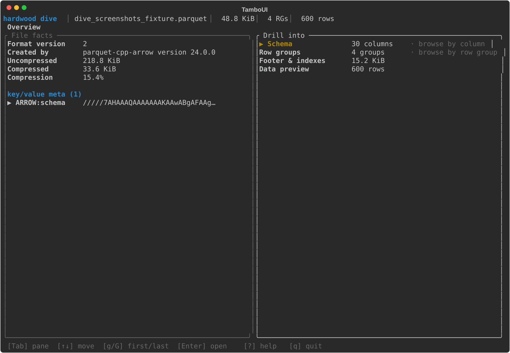
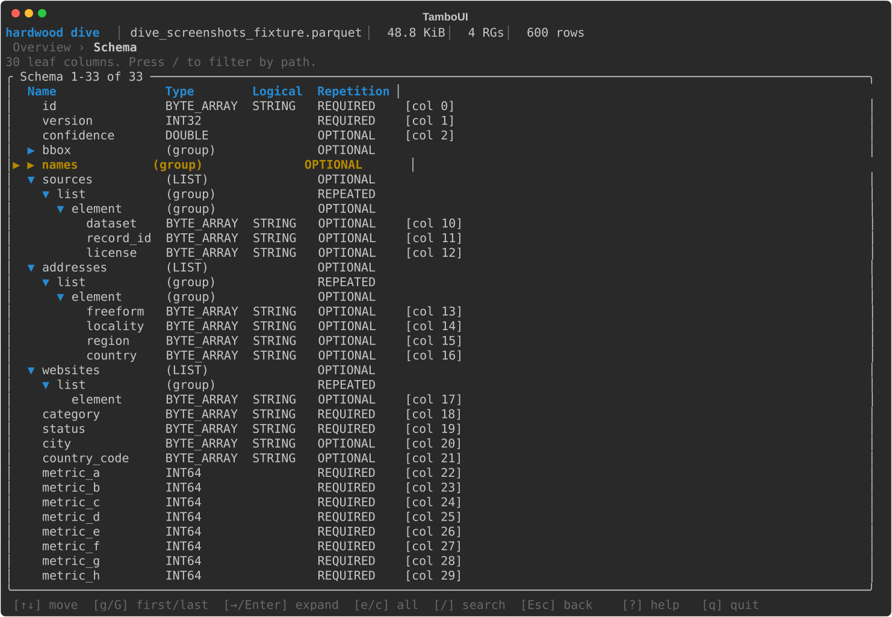
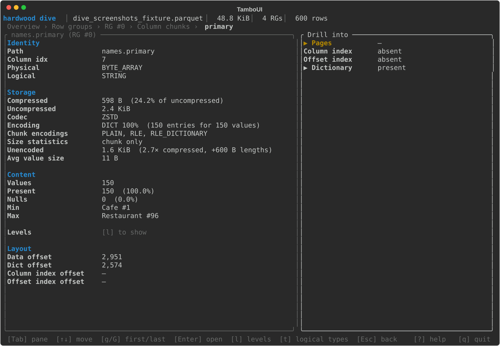
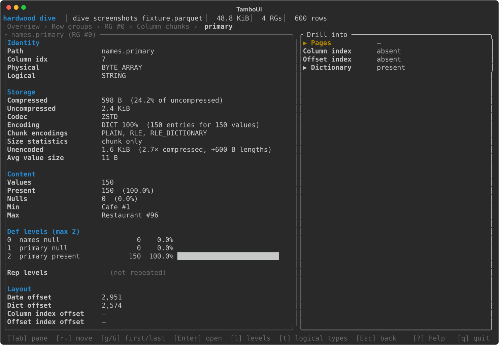
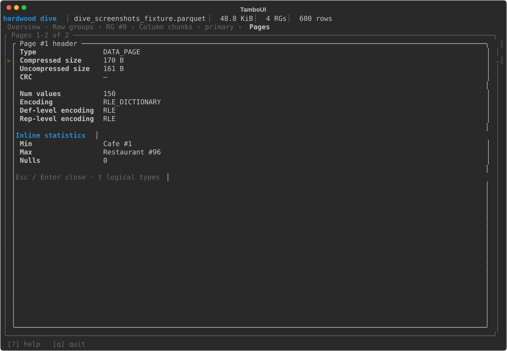
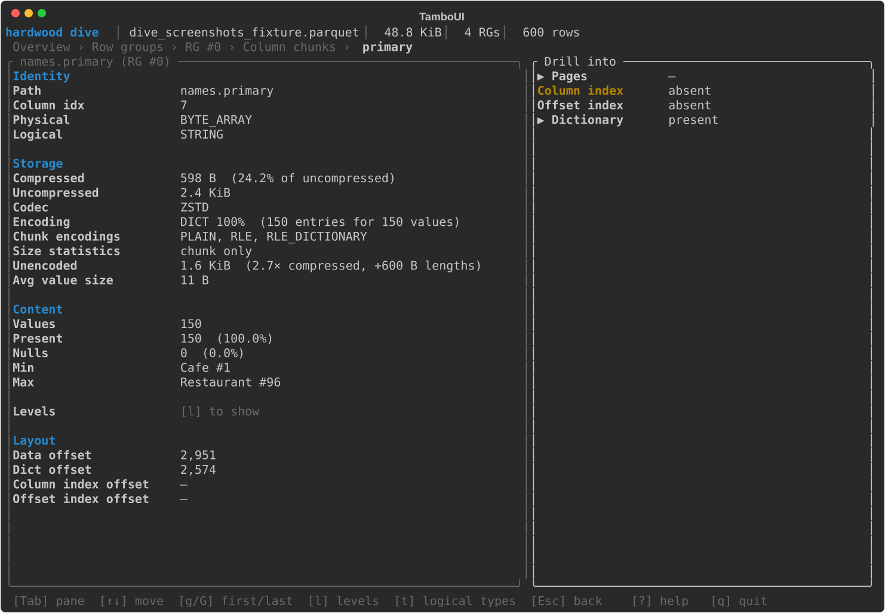
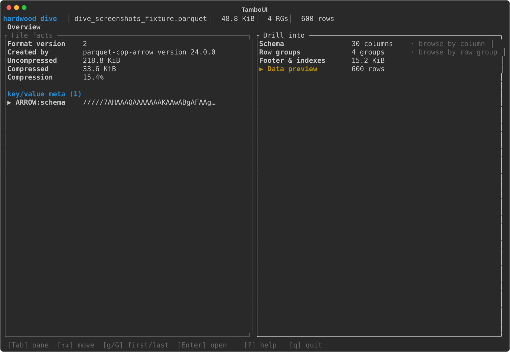

<!--

     SPDX-License-Identifier: CC-BY-SA-4.0

     Copyright The original authors

     Licensed under the Creative Commons Attribution-ShareAlike 4.0 International License;
     you may not use this file except in compliance with the License.
     You may obtain a copy of the License at https://creativecommons.org/licenses/by-sa/4.0/

-->
# CLI

The `hardwood` CLI lets you inspect and convert Parquet files from the command line — useful for exploring datasets, debugging file structure, and quick format conversions without writing Java code. It reads local files and S3 URIs, and ships as a GraalVM native binary with instant startup.

Pre-built native binaries for Linux, macOS, and Windows are available from the [release page](https://github.com/hardwood-hq/hardwood/releases/tag/{{cli_release_tag}}). You can also
run the CLI via Docker without installing it locally — see the [Docker section below](#docker).

!!! note "macOS"
    The binary is not notarized. On first run, macOS Gatekeeper will block it. Remove the quarantine flag after extracting:

    ```shell
    xattr -r -d com.apple.quarantine hardwood-cli-*/
    ```

## Available Commands

| Command | Description |
|---------|-------------|
| `hardwood info` | Display high-level file information, including key-value metadata |
| `hardwood schema` | Print the file schema, including logical-type annotations such as `VARIANT(1)` on Variant groups |
| `hardwood print` | Print rows as an ASCII table (head, tail, or all); Variant columns are decoded to JSON-like text |
| `hardwood convert` | Convert a Parquet file to CSV or JSON (head, tail, or all); JSON output writes numbers and booleans as JSON scalars and a null as `null`; Variant columns are emitted as a JSON string in CSV and as a native JSON subtree in JSON |
| `hardwood footer` | Print decoded footer length, offset, and file structure |
| `hardwood inspect pages` | List data and dictionary pages per column chunk; includes per-page min/max when the file has a page index |
| `hardwood inspect dictionary` | Print dictionary entries for a column |
| `hardwood inspect columns` | Rank columns by size, with each column's share of the file, its compression, its data-page encoding and dictionary cardinality, and its unencoded size |
| `hardwood inspect rowgroups` | Display per-row-group column chunk metadata (sizes, codec) |
| `hardwood dive` | Interactively explore a file's structure in a TUI |

Pass `--help` to any command (or `hardwood --help`) to print its usage.

## Examples

```shell
# Show file overview
hardwood info -f data.parquet

# Print schema
hardwood schema -f data.parquet

# Print the schema as Avro or Protobuf
hardwood schema -F AVRO -f data.parquet

# Print the full value of one key-value metadata entry
hardwood info -f data.parquet --kv-key ARROW:schema

# Show first 20 rows
hardwood print -n 20 -f data.parquet

# Show last 5 rows
hardwood print -n -5 -f data.parquet

# Show all rows
hardwood print -f data.parquet

# Convert to CSV
hardwood convert --format csv -f data.parquet

# Rank columns by size: share of the file, compression, encoding, unencoded size
hardwood inspect columns -f data.parquet

# Per-row-group detail and named level histograms for one column
hardwood inspect columns -f data.parquet --column order.tags.list.element

# Restrict that detail to a single row group
hardwood inspect columns -f data.parquet --column order.tags.list.element --row-group 0

# Show dictionary entries for a column (first 50 entries per row group by default)
hardwood inspect dictionary -f data.parquet -c category

# Show all dictionary entries for a column (--limit 0 means unlimited)
hardwood inspect dictionary -f data.parquet -c category --limit 0

# Convert first 100 rows to JSON
hardwood convert -n 100 --format json -f data.parquet

# Convert last 50 rows to CSV
hardwood convert -n -50 --format csv -f data.parquet

# Convert to CSV, writing \N for null values
hardwood convert --format csv --null-string '\N' -f data.parquet
```

## Convert output

`hardwood convert --format json` writes JSON numbers and booleans for
non-repeated `BOOLEAN`, `INT32`, `INT64`, `FLOAT`, and `DOUBLE` fields that
carry no logical annotation or an `INT` annotation. Date, time, timestamp,
decimal, UUID, interval, `FLOAT16`, `INT96`, byte-array, and nested values are
JSON strings.

Finite floating-point values are JSON numbers. `NaN`, `Infinity`, and
`-Infinity` are JSON strings, because JSON has no non-finite number values.

Unsigned integers are JSON numbers, including values above the signed 64-bit
range such as `18446744073709551615`. A JSON parser that represents numbers as
IEEE 754 doubles — most JavaScript ones do — reads such a value at reduced
precision; a parser with a big-integer mode reads it exactly.

A null is `null` in JSON. In CSV it is an empty field, which an empty string
value also produces, so the two read the same. Pass `--null-string VALUE` to
write something else for a null; the CSV quoting rules apply to that value like
any other. `--null-string` is a CSV option — combining it with `--format json`
is an error.

`--null-string` covers whole fields and flattened struct leaves. A null nested
inside a rendered list, map, or struct cell is the text `null` in that cell. A
Variant holding the Variant null is the text `null` too: that is a value the
column carries, not an absent one.

## Schema output formats

`hardwood schema` prints the Parquet schema in its native form by default.
`-F AVRO` and `-F PROTO` render it as an Avro schema or a Protobuf message
definition instead.

Avro names and Protobuf identifiers are both restricted to
`[A-Za-z_][A-Za-z0-9_]*`, while Parquet permits any name. Names outside that
grammar are rewritten in both formats: each character outside `[A-Za-z0-9_]`
becomes `_`, a leading `_` is prepended to a name starting with a digit, and
names that collide within one record or message after rewriting get a `_2`,
`_3`, … suffix.

A rewritten name keeps its Parquet name in the output — as a `doc` attribute
in Avro:

```json
{ "name": "total__usd_", "doc": "Parquet name: total (usd)", "type": "double" }
```

and as a comment in Protobuf:

```proto
// Parquet name: total (usd)
optional double total__usd_ = 1;
```

Lists and maps keep the element and value types of the Parquet schema in
both formats. Positions where the target grammar cannot express
nullability or nesting directly are wrapped: an optional list element or
map value is a `["null", T]` union in Avro and a single-field wrapper
message in Protobuf; a list inside a list, a list inside a map value, a map inside
a list, and a map inside a map value become wrapper messages in Protobuf. A map whose
`key_value` group carries no value renders with bare `null` values in
Avro and an empty value message in Protobuf.

Fixed-width columns keep their physical size: `fixed_len_byte_array(n)`
and `int96` become named Avro `fixed` types of `n` and 12 bytes, and the
`interval` and `float16` logical types map to shared 12- and 2-byte
`fixed` types defined once per schema.

Named types in Avro — records and fixed types — are unique by full name.
Each carries a namespace derived from its position, so two records with
the same Parquet name under different parents stay distinct:
`Schema.Home.Address` and `Schema.Work.Address`. Candidates that still
collide within one namespace get a `_2`, `_3`, … suffix on the *type*
name; field names keep their own suffixes independently, so a field may
read `address_2` while its type reads `Address_2`. The same
uniqueness rule covers Protobuf message declarations, including the
synthesized wrapper messages.

## Key-value metadata

`hardwood info` prints a file's key-value metadata below the size summary, one
line per entry: the key, its value's byte length, and the value itself. Values
wider than 60 columns are truncated with a trailing `…`, since these routinely
carry kilobytes of embedded JSON (e.g.
`org.apache.spark.sql.parquet.row.metadata`) or a base64-encoded Arrow IPC
schema (`ARROW:schema`). Control characters in a value print as `·`:

```
Key/Value Metadata (3):
  ARROW:schema                               4.1 KiB  /////5AEAABAAAAAAAAKAAwABgAFAAgACgAAAAABBAA…
  org.apache.spark.sql.parquet.row.metadata  1.8 KiB  {"type":"struct","fields":[{"name":"order_i…
  writer.build                                     —
```

An entry may carry a key with no value at all, which is distinct from a key
whose value is empty. The size column tells the two apart: `—` for a value that
is absent, `0 B` for one that is present and empty.

Pass `--kv-key <name>` to print one entry's value in full, untruncated and with
no substitutions, and no other output — safe to pipe into another tool:

```shell
hardwood info -f data.parquet --kv-key ARROW:schema | base64 -d | xxd | head
```

`--kv-key` exits non-zero if the file has no entry under that name, or if the
entry has no value.

## Binary values

A `BYTE_ARRAY` or `FIXED_LEN_BYTE_ARRAY` column with no logical-type annotation
carries bytes the schema gives no interpretation for — text from a writer that
omitted the `STRING` annotation, or an opaque payload such as WKB geometry, a
Protobuf message or a hash. Every command decides from the bytes themselves:
well-formed UTF-8 with no control characters prints as text, anything else
prints as `0x`-prefixed lowercase hex. The same rule applies to values,
dictionary entries and min/max statistics alike, and to a byte-backed logical
type whose payload length rules out its own decoder.

Each table column holds 50 cells, and a value wider than that is cut with a
trailing `…`. `print`, `inspect dictionary` and `inspect pages` take `-w N` for
a different cap and `--no-truncate` for none at all; `dive` sizes its cells from
the terminal instead. `convert` carries the whole value.

```shell
# A GeoParquet 1.x geometry column: unannotated BYTE_ARRAY holding WKB
hardwood print -n 1 -c geometry -f places.parquet
# | 0x010100000000000000005366c0f71622f0fa1955c0 |

hardwood inspect pages -c geometry -f places.parquet
# | Min                                          | Max                                          |
# | 0x010100000000000000005366c0f71622f0fa1955c0 | 0x0101000000ffffb00000005366c0f71622f0fa1955 |

hardwood inspect pages -c geometry -w 20 -f places.parquet
# | Min                  | Max                  |
# | 0x0101000000000000… | 0x0101000000ffffb0… |
```

## Interactive exploration (`dive`)

`hardwood dive` launches a terminal UI for interactively navigating a Parquet file's structure:

```shell
hardwood dive -f data.parquet
```

`dive` requires an interactive terminal. When stdin or stdout is not a TTY (e.g., a `docker run` without `-it`, or output piped to a file), it exits with an error instead of launching the UI.

<script src="https://asciinema.org/a/992284.js" id="asciicast-992284" async="true"></script>

### What you can do with it

`dive` composes the slices that the batch subcommands (`info`, `schema`,
`footer`, `inspect`, `print`) each surface separately into a single
navigable session. Typical things to reach for it for:

- **Find a column quickly** in a wide schema — Schema screen, `/` to
  filter the tree to leaves matching a substring.
- **Spot the heavy column chunks** in a row group — Row groups → Column
  chunks ranks by compressed size with the codec and dictionary flag
  alongside. Schema → a leaf column → the row-group table does the same
  across row groups for one column, and adds its unencoded size.
- **Check page-level statistics and indexes** — drill from a chunk into
  Pages, Column index, or Offset index; `Enter` on a page opens the
  full thrift header, including inline statistics when no Column Index
  is present.
- **See where a column's size and nulls come from** — Column chunk
  detail groups its facts into Identity, Storage, Content and Layout.
  Storage carries the unencoded size, what it expands to from disk, and
  the encoding the data pages use with its dictionary's cardinality;
  Content the record and present-value counts. `l` adds the repetition
  and definition level histograms with each level named after the schema
  node it belongs to, so an absent field reads differently from an empty
  list. The pane scrolls with `↑↓` when it has focus; its title shows a
  line range whenever anything is below the fold.
- **Inspect dictionary entries** for a column — Dictionary screen with
  `/` substring filter; `Enter` reveals the full untruncated value of
  the highlighted entry.
- **Preview a few rows** without exporting — Data preview paginates with
  `PgDn`/`PgUp` (`g`/`G` for first/last); `Enter` opens a per-row modal.
  In the modal `↑`/`↓` step between the fields whose full value isn't
  already on screen, `Enter` expands the focused one inline, and
  `PgDn`/`PgUp` scroll the body.
- **Decode key/value metadata** — Spark JSON schemas pretty-print, Arrow
  IPC schemas decode to a hex dump.
- **Compare a column across row groups** — from Schema, `Enter` on a
  leaf jumps to a one-row-per-RG view of that column's sizes,
  encodings, and stats.
- **Read raw file layout** — Footer & indexes shows file size, footer
  offset, encoding/codec histograms, page-index coverage, and aggregate
  byte breakdowns; from there you can drill into a file-wide list of
  every chunk's column index, offset index, or dictionary region.

### Keys

| Key | Action |
|-----|--------|
| `↑` / `↓` | Move selection |
| `PgDn` / `PgUp` (or `Shift-↓` / `Shift-↑`) | Page down / up; scroll the body of the Data preview row modal |
| `g` / `G` | Jump to first / last row |
| `Enter` | Drill into the selected item |
| `Esc` / `Backspace` | Go back one level |
| `Tab` / `Shift-Tab` | Switch focused pane |
| `/` | Inline search (Schema, Column index, Dictionary) |
| `t` | Toggle logical / physical value rendering (screen-specific: Pages, Column index, Dictionary, Data preview, Column chunk detail) |
| `l` | Toggle the repetition / definition level histograms (Column chunk detail) |
| `↑` / `↓` | Scroll the facts pane when it has focus (Column chunk detail) |
| `e` / `c` | Expand / collapse all (Schema tree; Data preview row modal) |
| `o` | Jump back to Overview |
| `?` | Toggle help overlay |
| `q` / `Ctrl-C` | Quit |

The keybar at the bottom of every screen lists the keys that are
actually meaningful in the current context — so the menus above show the
full vocabulary, but the keybar tells you which subset is live right
now.

Available screens:

- **Overview**
- **Schema** — expandable tree of groups and leaves
- **Row groups**
- **Row group detail**
- **Column chunks**
- **Column chunk detail** — facts pane plus drill menu
- **Pages** — with a page-header modal on Enter
- **Column index**
- **Offset index**
- **Footer & indexes** — also drills into a file-wide list of every chunk's column index, offset index, or dictionary region
- **Column-across-row-groups** — from the Schema screen
- **Dictionary** — full-value modal on Enter and `/` inline search
- **Data preview** — row values via `RowReader`; `←/→` scrolls the visible column window, `PgDn/PgUp` flips pages

A tour through the main screens (click any shot to open it full size):

<figure markdown="span">[{ width="720" }](../assets/cli/01-landing-overview.svg)<figcaption>Overview</figcaption></figure>

<figure markdown="span">[{ width="720" }](../assets/cli/02-schema-tree.svg)<figcaption>Schema — expandable tree of groups and leaves</figcaption></figure>

<figure markdown="span">[{ width="720" }](../assets/cli/03-1-rg.svg)<figcaption>Row groups</figcaption></figure>

<figure markdown="span">[{ width="720" }](../assets/cli/03-2-rg-detail.svg)<figcaption>Row group detail</figcaption></figure>

<figure markdown="span">[{ width="720" }](../assets/cli/03-3-rg-column-chunks.svg)<figcaption>Column chunks</figcaption></figure>

<figure markdown="span">[{ width="720" }](../assets/cli/03-4-rg-column-chunk-detail.svg)<figcaption>Column chunk detail — facts pane plus drill menu</figcaption></figure>

<figure markdown="span">[{ width="720" }](../assets/cli/03-5-rg-column-chunk-levels.svg)<figcaption>Column chunk detail with <code>l</code> — repetition and definition level histograms</figcaption></figure>

<figure markdown="span">[{ width="720" }](../assets/cli/04-pages-header-modal.svg)<figcaption>Pages — page-header modal on Enter</figcaption></figure>

<figure markdown="span">[{ width="720" }](../assets/cli/05-dict-search.svg)<figcaption>Dictionary — <code>/</code> inline search</figcaption></figure>

<figure markdown="span">[{ width="720" }](../assets/cli/06-data-scrolled-right.svg)<figcaption>Data preview — scrolled right across the column window</figcaption></figure>

Every screen shares a four-region layout — a top bar with file identity, a
breadcrumb showing the navigation stack, the active screen body, and a keybar
(all four visible in the Overview screenshot above).

### Typical drill path

1. **Overview** → pick *Row groups* from the drill menu.
2. **Row groups** → select a row, *Enter* — opens that row group's detail.
3. **Row group detail** → *Enter* — opens its column chunks.
4. **Column chunks** → select a column, *Enter* — opens the chunk detail.
5. **Column chunk detail** (facts pane + drill menu) → pick *Pages*, *Column
   index*, *Offset index*, or *Dictionary*.
6. Drill sub-screens (*Pages*, *Column index*, etc.) support *Esc* back up to
   the previous level; in *Pages* and *Dictionary*, *Enter* opens a modal with
   the full header / value.

Alternative entry: from **Overview → Schema**, navigate the tree of group and
primitive nodes with `→` / `←`; `Enter` on a leaf drills into a
*Column-across-row-groups* view — one row per row group showing that column's
sizes, encoding, stats — and from there into the chunk detail.

### Inline search

The **Schema**, **Column index**, and **Dictionary** screens support inline
search. Press `/` to enter search-edit mode:

- **Schema** — filters leaf columns whose field path contains the query.
  While the filter is active, the tree collapses to a flat list of matches.
- **Column index** — filters pages whose formatted min or max value
  contains the query.
- **Dictionary** — filters entries whose value contains the query.

In all three cases: typed characters extend the filter; *Backspace* trims;
*Esc* clears the filter and exits edit mode; *Enter* commits (keeps the
filter applied but exits edit mode). The table re-filters live as you type.

## Reading Files from S3

All commands accept `s3://` URIs via the `-f` flag:

```shell
hardwood schema -f s3://my-bucket/data.parquet
hardwood print -n 10 -f s3://my-bucket/data.parquet
```

The CLI resolves credentials via the standard AWS credential chain (`AWS_ACCESS_KEY_ID` / `AWS_SECRET_ACCESS_KEY` / `AWS_SESSION_TOKEN` environment variables, `~/.aws/credentials`, SSO, EC2/ECS instance profiles, web identity). See the [S3 module page](../how-to/s3.md) for the resolution order and provider details.

The CLI additionally reads these environment variables:

| Environment Variable | Description |
|----------------------|-------------|
| `AWS_REGION` | AWS region (also read from `~/.aws/config` if not set) |
| `AWS_ENDPOINT_URL` | Custom endpoint for S3-compatible services (MinIO, LocalStack, R2, etc.) |
| `AWS_PATH_STYLE` | Set to `true` to use path-style access (required by some S3-compatible services) |

## Shell Completion

The distribution includes completion scripts for Bash, Zsh, and Fish under `bin/`:

| Shell | Script |
|-------|--------|
| Bash | `bin/hardwood_completion` |
| Zsh | `bin/hardwood_completion.zsh` |
| Fish | `bin/hardwood_completion.fish` |

Source the one for your shell to enable tab completion for commands, options, and arguments:

```shell
source hardwood_completion
```

To make it permanent, add the line above to your shell's startup file (e.g. `~/.bashrc`, `~/.zshrc`).

## Use with AI coding agents

The repository ships an [Agent Skill](https://agentskills.io) at `skills/hardwood-cli/` that teaches an AI coding agent when and how to reach for the CLI while debugging Parquet read/write code (checking schema and physical/logical types, diagnosing why predicate pushdown or page skipping isn't happening, reading dictionary entries, and so on).

For [Claude Code](https://claude.com/claude-code), it is packaged as the `hardwood` plugin, distributed from the [`hardwood-skills`](https://github.com/hardwood-hq/hardwood-skills) marketplace. Install it once — inside Claude Code, run:

```text
/plugin marketplace add hardwood-hq/hardwood-skills
/plugin install hardwood@hardwood-skills
```

After installing, the skill loads automatically in future sessions whenever a task involves a Parquet file. It drives the `hardwood` binary, so ensure `hardwood` is on your `PATH` (from the [release page](https://github.com/hardwood-hq/hardwood/releases/tag/{{cli_release_tag}}) or the Docker image below).

For other agent harnesses — or a Claude Code setup without the plugin — copy `skills/hardwood-cli/SKILL.md` into that tool's skills directory (for Claude Code that is `~/.claude/skills/hardwood-cli/`).

## Docker

A minimal Fedora-based Docker image is published to the GitHub Container Registry for Linux amd64 and arm64:

```shell
docker pull ghcr.io/hardwood-hq/hardwood:{{cli_docker_tag}}
```

Run any command by passing it after the image name:

```shell
docker run --rm ghcr.io/hardwood-hq/hardwood:{{cli_docker_tag}} --help
docker run --rm ghcr.io/hardwood-hq/hardwood:{{cli_docker_tag}} info -f /data/data.parquet
```

Mount a local directory to access files on the host:

```shell
docker run --rm \
  -v "$(pwd)":/data \
  ghcr.io/hardwood-hq/hardwood:{{cli_docker_tag}} \
  schema -f /data/data.parquet
```

The `dive` TUI needs an interactive terminal, so pass `-it`:

```shell
docker run --rm -it \
  -v "$(pwd)":/data \
  ghcr.io/hardwood-hq/hardwood:{{cli_docker_tag}} \
  dive -f /data/data.parquet
```

Start an interactive shell with tab completion pre-loaded:

```shell
docker run --rm -it \
  -v "$(pwd)":/data \
  ghcr.io/hardwood-hq/hardwood:{{cli_docker_tag}}
```
