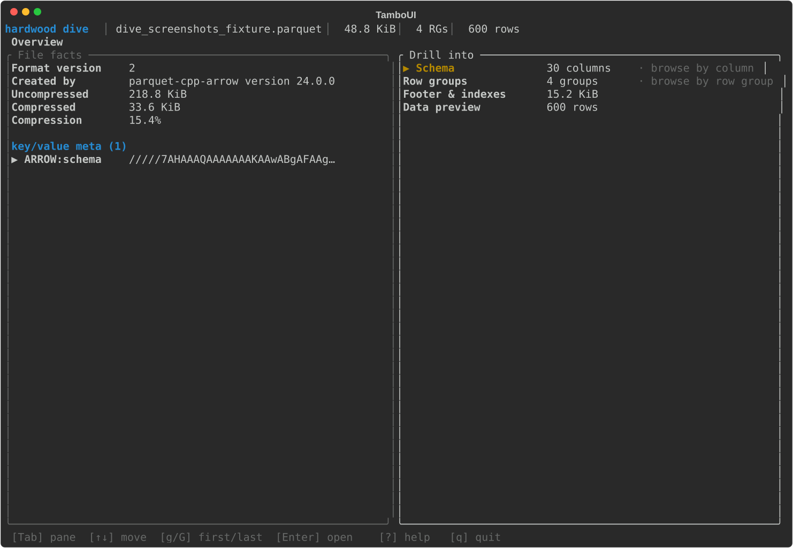
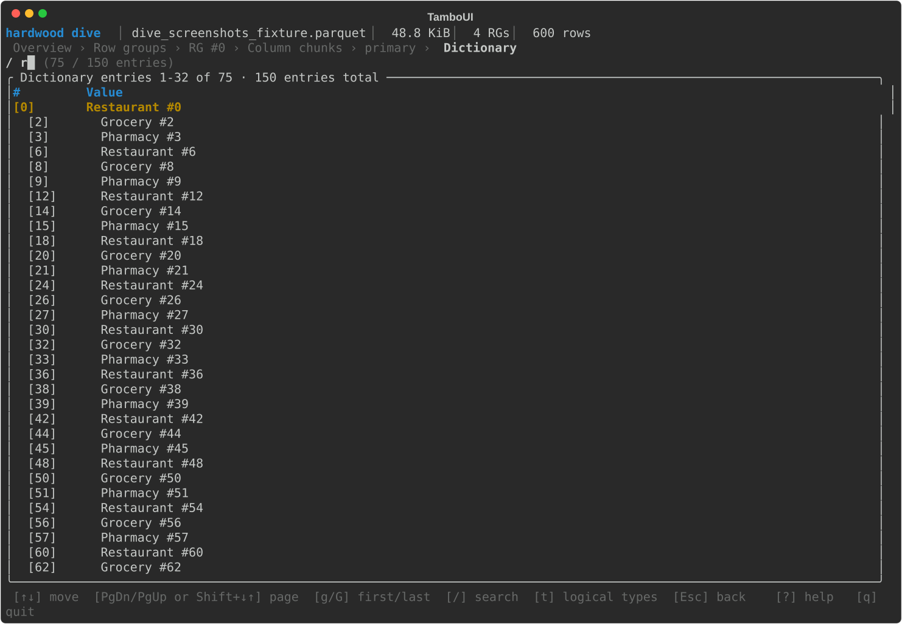
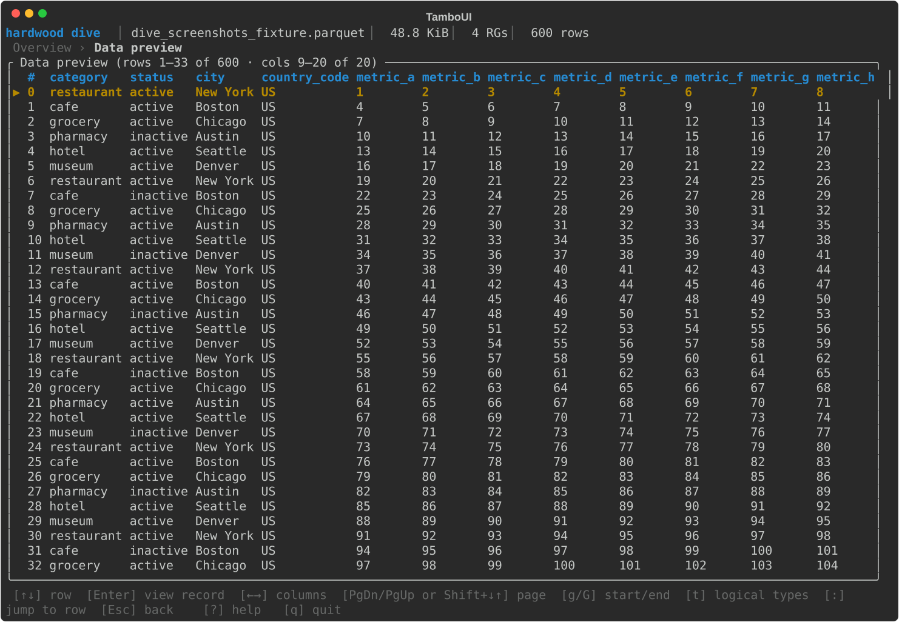

<!--

     SPDX-License-Identifier: CC-BY-SA-4.0

     Copyright The original authors

     Licensed under the Creative Commons Attribution-ShareAlike 4.0 International License;
     you may not use this file except in compliance with the License.
     You may obtain a copy of the License at https://creativecommons.org/licenses/by-sa/4.0/

-->
# CLI

The `hardwood` CLI inspects and converts Parquet files from the command line. Its commands run non-interactively, for use in scripts and by [AI coding agents](../getting-started.md#use-with-ai-coding-agents), and [`hardwood dive`](#interactive-exploration-dive) opens an interactive terminal UI for exploring a file by hand. It reads local files and S3 URIs. [Getting Started](../getting-started.md#command-line-tool) covers installation.

A command writes its result to standard output and any warning or error to standard error, so its output can be piped or redirected to a file as is.

## Available Commands

| Command | Description |
|---------|-------------|
| `hardwood info` | Display high-level file information, including key-value metadata |
| `hardwood schema` | Print the file schema, including logical-type annotations such as `VARIANT(1)` on Variant groups |
| `hardwood print` | Print rows as an ASCII table (head, tail, or all) |
| `hardwood convert` | Convert a Parquet file to CSV or JSON (head, tail, or all) |
| `hardwood footer` | Print decoded footer length, offset, and file structure |
| `hardwood inspect pages` | List data and dictionary pages per column chunk; includes per-page min/max when the file has a page index |
| `hardwood inspect dictionary` | Print dictionary entries for a column |
| `hardwood inspect columns` | Rank columns by size, with each column's share of the file, its compression, its data-page encoding and dictionary cardinality, and its unencoded size |
| `hardwood inspect rowgroups` | Display per-row-group column chunk metadata (sizes, codec) |
| `hardwood dive` | Interactively explore a file's structure in a TUI |

Pass `--help` to any command (or `hardwood --help`) to print its usage.

## Examples

```shell
# Show file overview
hardwood info -f data.parquet

# Print schema
hardwood schema -f data.parquet

# Print the schema as Avro or Protobuf
hardwood schema -F AVRO -f data.parquet

# Show first 20 rows
hardwood print -n 20 -f data.parquet

# Show last 5 rows
hardwood print -n -5 -f data.parquet

# Start at row 5000 (rows are counted from 0)
hardwood print --skip 5000 -n 20 -f data.parquet

# Show the rows of row group 3 (row groups are counted from 0)
hardwood print --row-group 3 -f data.parquet

# Convert to CSV
hardwood convert --format csv -f data.parquet

# Rank columns by size: share of the file, compression, encoding, unencoded size
hardwood inspect columns -f data.parquet

# Per-row-group detail and named level histograms for one column
hardwood inspect columns -f data.parquet --column order.tags.list.element

# Restrict that detail to a single row group
hardwood inspect columns -f data.parquet --column order.tags.list.element --row-group 0

# Show dictionary entries for a column (first 50 entries per row group by default)
hardwood inspect dictionary -f data.parquet -c category

# Show all dictionary entries for a column (--limit 0 means unlimited)
hardwood inspect dictionary -f data.parquet -c category --limit 0

# Convert first 100 rows to JSON
hardwood convert -n 100 --format json -f data.parquet

# Convert one row group to CSV
hardwood convert --row-group 3 --format csv -f data.parquet

# Convert to CSV, writing \N for null values
hardwood convert --format csv --null-string '\N' -f data.parquet
```

## Row selection

`print` and `convert` accept the same row-selection options:

| Option | Rows selected |
|---|---|
| `-n N`, `--rows N` | The first `N` rows for a positive number, the last `N` rows for a negative number, or every row for `ALL` (the default). `0` is rejected. |
| `--skip N` | Start at row `N`, counted from zero. A positive `-n` limits the number of rows read from that position. |
| `--row-group I` | Read only row group `I`, counted from zero. A positive `-n` limits the read to at most that many rows within the group. |

`--skip` and `--row-group` cannot be combined with each other or with a negative `-n`.
Negative or out-of-range row and row-group numbers are rejected. `--skip` must identify
an existing row, and `--row-group` rejects an empty row group.

`print --row-index` shows each row's zero-based position in the original file,
including when using `--skip`, `--row-group`, or a negative `-n`. For a file with
100 rows, `-n -2 --row-index` prints indexes `98` and `99`.

## Convert output

`hardwood convert --format json` writes JSON numbers and booleans for
`BOOLEAN`, `INT32`, `INT64`, `FLOAT`, and `DOUBLE` values that carry no
logical annotation or an `INT` annotation. Date, time, timestamp, decimal,
UUID, interval, `FLOAT16`, `INT96`, and byte-array values are JSON strings.
Decimals are always plain strings: `0.0000001`, never `1E-7`.

Nested values are native JSON: a struct is an object, a list or repeated field
an array, and a map an object keyed by each map key's text. Values inside them
follow the same rules as top-level fields. CSV has no nested structure, so a
list, repeated field, map, or Variant in a CSV cell is the same JSON as text.

Finite floating-point values are JSON numbers. `NaN`, `Infinity`, and
`-Infinity` are JSON strings, because JSON has no non-finite number values.
This holds for floating-point values inside Variant columns too.

String values are written verbatim, control characters included: JSON escapes
them, and CSV quotes a field that holds a line feed or a carriage return.

Unsigned integers are JSON numbers, including values above the signed 64-bit
range such as `18446744073709551615`. A JSON parser that represents numbers as
IEEE 754 doubles (most JavaScript ones do) reads such a value at reduced
precision; a parser with a big-integer mode reads it exactly.

A null is `null` in JSON. In CSV it is an empty field, which an empty string
value also produces, so the two read the same. Pass `--null-string VALUE` to
write something else for a null; the CSV quoting rules apply to that value like
any other. `--null-string` is a CSV option; combining it with `--format json`
is an error.

`--null-string` covers whole fields and flattened struct leaves. A null nested
inside a rendered list, map, or struct cell is the text `null` in that cell. A
Variant holding the Variant null is the text `null` too: that is a value the
column carries, not an absent one.

## Value rendering

Every command spells a value of a given logical type the same way:

| Type | Example |
|---|---|
| Timestamp adjusted to UTC, and `INT96` | `2025-01-01T00:00:00Z` |
| Timestamp without a time zone | `2025-01-01T00:00` |
| Date | `2025-04-24` |
| Decimal | `0.0000001` |
| UUID | `f81d4fae-7dec-11d0-a765-00a0c91e6bf6` |

`INT96` min/max statistics render as timestamps too.

`print` and `dive` render nested and Variant values in one unquoted display
grammar: structs and maps as `{ a : 1 }`, lists as `[1, 2]`, Variant objects
and arrays in the same shape. `convert` follows [Convert output](#convert-output).

In `print`, `dive`, `inspect` and `info`, a control character in a string
value or a key-value metadata key renders as `·`, and a value or key made
entirely of control characters as `0x`-prefixed hex of its UTF-8 bytes.

A min/max statistic or dictionary entry that does not decode as its type
renders in its stored form: bytes whose length does not match the type as
`0x`-prefixed hex, a `TIME` outside a day as its stored integer. A malformed
`UUID`, `INTERVAL` or `INT96` value in a row makes `print` and `convert` fail.

## Schema output formats

`hardwood schema` prints the Parquet schema in its native form by default.
`-F AVRO` and `-F PROTO` render it as an Avro schema or a Protobuf message
definition instead.

Names outside `[A-Za-z_][A-Za-z0-9_]*` are rewritten in both formats by the
rules in [Avro names](../how-to/avro.md#avro-names), including the `_2`, `_3`, …
suffix for names that collide within one record or message.

A rewritten name keeps its Parquet name in the output, as a `doc` attribute
in Avro:

```json
{ "name": "total__usd_", "doc": "Parquet name: total (usd)", "type": "double" }
```

and as a comment in Protobuf:

```proto
// Parquet name: total (usd)
optional double total__usd_ = 1;
```

Lists and maps keep the element and value types of the Parquet schema in
both formats. Positions where the target grammar cannot express
nullability or nesting directly are wrapped: an optional list element or
map value is a `["null", T]` union in Avro and a single-field wrapper
message in Protobuf; a list inside a list, a list inside a map value, a map inside
a list, and a map inside a map value become wrapper messages in Protobuf. A map whose
`key_value` group carries no value renders with bare `null` values in
Avro and an empty value message in Protobuf.

A repeated field outside a list or map, such as `repeated int32 ids` or a
repeated group, is a list of its own elements: a non-nullable Avro `array`
of the element type, and a `repeated` field in Protobuf. A repeated group
that holds a map renders as an array of maps in Avro and as a repeated
wrapper message in Protobuf.

Fixed-width columns keep their physical size: `fixed_len_byte_array(n)`
and `int96` become named Avro `fixed` types of `n` and 12 bytes, and the
`interval` and `float16` logical types map to shared 12- and 2-byte
`fixed` types defined once per schema. Protobuf has no fixed-width scalar,
so fixed-width values render as `bytes`, except UUID-annotated fixed arrays,
which render as `string`; `int96` renders as `bytes` to keep all twelve bytes.

Named types in Avro — records and fixed types — are unique by full name.
Each carries a namespace derived from its position, so two records with
the same Parquet name under different parents stay distinct:
`Schema.Home.Address` and `Schema.Work.Address`. Candidates that still
collide within one namespace get a `_2`, `_3`, … suffix on the *type*
name; field names keep their own suffixes independently, so a field may
read `address_2` while its type reads `Address_2`. A list or map field
names a namespace for its own nested types, so it competes for that name
with the record types declared beside it. The same
uniqueness rule covers Protobuf message declarations, including the
synthesized wrapper messages.

## Key-value metadata

`hardwood info` prints a file's key-value metadata below the size summary, one
line per entry: the key, its value's byte length, and the value itself. Values
wider than 60 columns are truncated with a trailing `…`:

```
Key/Value Metadata (3):
  ARROW:schema                               4.1 KiB  /////5AEAABAAAAAAAAKAAwABgAFAAgACgAAAAABBAA…
  org.apache.spark.sql.parquet.row.metadata  1.8 KiB  {"type":"struct","fields":[{"name":"order_i…
  writer.build                                     —
```

Pass `--kv-key <name>` to print one entry's value in full, untruncated and with
no substitutions, and no other output, so it is safe to pipe into another tool:

```shell
hardwood info -f data.parquet --kv-key ARROW:schema | base64 -d | xxd | head
```

`--kv-key` exits non-zero if the file has no entry under that name, or if the
entry has no value.

## Counts

Every command and every `dive` screen groups the digits of a count or a row index in threes with a comma: `1,048,576`. The `rowIndex` column of `hardwood print --row-index` is data rather than a figure about the file, and prints plain digits like the values beside it. A script that parses a count removes the commas first.

## Absent values

Every command and every `dive` screen renders a quantity the file does not carry
as `—`. A column's `# Pages` without a page index, a page's `Min` and `Max`
without statistics, a `Compression` with no uncompressed size to divide by, a
key/value entry with no value: all read the same way, on both surfaces.

`0 B`, `0`, and `""` are values the writer recorded; `—` says it recorded none.
A `—` quantity could have been written and was not; rewriting the file with
statistics or a page index fills it in. A quantity that cannot exist for the
row at hand reads `N/A` instead: an index page has no data encoding.

A script reading these tables should match `—` (U+2014 EM DASH) to detect an
absent cell:

```shell
# Columns whose page count the file does not carry
hardwood inspect columns -f data.parquet | awk -F'|' '$11 ~ /—/ {print $3}'
```

## Binary values

A `BYTE_ARRAY` or `FIXED_LEN_BYTE_ARRAY` column with no logical-type annotation
carries bytes the schema gives no interpretation for: text from a writer that
omitted the `STRING` annotation, or an opaque payload such as WKB geometry, a
Protobuf message or a hash. Every command decides from the bytes themselves:
well-formed UTF-8 with no control characters prints as text unless it starts
with `0x`; anything else prints as `0x`-prefixed lowercase hex, so a `0x…`
value always means bytes. The same rule applies to values,
dictionary entries and min/max statistics alike, and to a byte-backed logical
type whose payload length rules out its own decoder.

Each table column holds 50 cells, and a value wider than that is cut with a
trailing `…`. `print`, `inspect dictionary` and `inspect pages` take `-w N` for
a different cap and `--no-truncate` for none at all; `dive` sizes its cells from
the terminal instead. `convert` carries the whole value.

```shell
# A GeoParquet 1.x geometry column: unannotated BYTE_ARRAY holding WKB
hardwood print -n 1 -c geometry -f places.parquet
# | 0x010100000000000000005366c0f71622f0fa1955c0 |

hardwood inspect pages -c geometry -f places.parquet
# | Min                                          | Max                                          |
# | 0x010100000000000000005366c0f71622f0fa1955c0 | 0x0101000000ffffb00000005366c0f71622f0fa1955 |

hardwood inspect pages -c geometry -w 20 -f places.parquet
# | Min                  | Max                  |
# | 0x0101000000000000… | 0x0101000000ffffb0… |
```

## Interactive exploration (`dive`)

`hardwood dive` launches a terminal UI for interactively navigating a Parquet file's structure:

```shell
hardwood dive -f data.parquet
```

`dive` requires an interactive terminal. When stdin or stdout is not a TTY (e.g., a `docker run` without `-it`, or output piped to a file), it exits with an error instead of launching the UI.

`dive` writes no warnings to the terminal while it runs. `--log-file <path>` writes them to `<path>` instead, together with a trace of the session's reads, replacing the file's contents; `dive` exits with an error when it cannot create the file.

<link rel="stylesheet" href="../../stylesheets/asciinema-player.css">
<div id="dive-player"></div>
<div id="dive-caption" class="dive-caption"></div>
<script src="../../javascripts/asciinema-player.min.js"></script>
<script>
  (function() {
    var cast = '../../assets/cli/dive-demo.cast';
    var caption = document.getElementById('dive-caption');
    var player = AsciinemaPlayer.create(cast, document.getElementById('dive-player'), {
      cols: 120,
      rows: 35,
      theme: 'solarized-dark'
    });
    // The cast's marker events carry the captions; seeking fires no marker
    // event, so the bar follows the playback position instead.
    fetch(cast).then(function(response) { return response.text(); }).then(function(text) {
      var markers = text.split('\n').slice(1).filter(function(line) {
        return line.indexOf('"m"') !== -1;
      }).map(function(line) {
        return JSON.parse(line);
      }).filter(function(event) {
        return event[1] === 'm';
      });
      function show(time) {
        var current = markers[0];
        markers.forEach(function(marker) {
          if (marker[0] <= time) {
            current = marker;
          }
        });
        caption.textContent = current[2];
      }
      show(0);
      setInterval(function() {
        Promise.resolve(player.getCurrentTime()).then(show);
      }, 200);
    });
  })();
</script>

### Keys

| Key | Action |
|-----|--------|
| `↑` / `↓` | Move the cursor one row in the focused pane (lists, menus, facts panes, the Data preview row modal) |
| `PgDn` / `PgUp` (or `Shift-↓` / `Shift-↑`) | Move the cursor one page down / up |
| `g` / `G` | Move the cursor to the first / last row |
| `Enter` | Drill into the selected item |
| `Esc` / `Backspace` | Go back one level |
| `Tab` / `Shift-Tab` | Switch focused pane |
| `/` | Inline search (Schema, Column index, Dictionary) |
| `t` | Toggle logical / physical value rendering (screen-specific: Pages, Column index, Dictionary, Data preview, Column chunk detail) |
| `l` | Toggle the repetition / definition level histograms (Column chunk detail) |
| `e` / `c` | Expand / collapse all (Schema tree; Data preview row modal) |
| `:` | Jump to a row or row group by number (Data preview, Row groups) |
| `d` | Open the Data preview at the row group under the cursor (Row groups, Row group detail) |
| `o` | Jump back to Overview |
| `?` | Toggle help overlay |
| `q` / `Ctrl-C` | Quit |

The keybar at the bottom of every screen lists the keys that
apply in the current context; the menus above list every key.

### Screens

Every screen shares a four-region layout: a top bar with file identity, a
breadcrumb showing the navigation stack, the active screen body, and a keybar:

<figure markdown="span">[{ width="720" }](../assets/cli/01-landing-overview.svg)<figcaption>Overview</figcaption></figure>

**Overview** drills into **Row groups** → **Row group detail** → **Column chunks** →
**Column chunk detail**, whose drill menu opens **Pages**, **Column index**, **Offset index**
and **Dictionary**. **Schema**, **Footer & indexes** and **Data preview** open from Overview too.

- **Overview** — file summary and key/value metadata, with Spark JSON schemas pretty-printed and
  Arrow IPC schemas decoded to a hex dump
- **Schema** — expandable tree of groups and leaves, navigated with `→` / `←`
- **Row groups** — `:` jumps to a row group by number, `d` opens the Data preview at the selected group's first row
- **Row group detail** — `d` opens the Data preview at this row group's first row
- **Column chunks** — the chunks of one row group in column order, with type, codec, compressed size and
  dictionary flag
- **Column chunk detail** — facts pane grouped into Identity, Storage, Content and Layout, whose
  cursor passes over the group headings, plus drill menu; `l` adds the repetition and definition level histograms, each level named after
  the schema node it belongs to
- **Pages** — `Enter` opens the full page header, including inline statistics when the chunk
  has no column index
- **Column index**
- **Offset index**
- **Footer & indexes** — file size, footer offset, encoding and codec histograms, page-index
  coverage and aggregate byte breakdowns; drills into a file-wide list of every chunk's column
  index, offset index, or dictionary region
- **Column-across-row-groups** — `Enter` on a Schema leaf: one row per row group with that
  column's sizes (including unencoded size), encodings and stats; drills into the chunk detail
- **Dictionary** — `Enter` shows the full value of an entry; `/` inline search
- **Data preview** — row values via `RowReader`, with a `#` column giving each row's position in the file, counted from 0; `←/→` scrolls the visible column window,
  `PgDn/PgUp` flips pages; `:` jumps to a row by number; `Enter` opens a per-row modal, where the cursor stops on every line and
  `Enter` expands the field under it when its full value is not on screen

<figure markdown="span">[{ width="720" }](../assets/cli/05-dict-search.svg)<figcaption>Dictionary with <code>/</code> inline search</figcaption></figure>

<figure markdown="span">[{ width="720" }](../assets/cli/06-data-scrolled-right.svg)<figcaption>Data preview scrolled right with <code>→</code></figcaption></figure>

### When a file will not read

Any screen that reads from the file shows a **Read failed** overlay in place of
itself when the read does not come back. The session stays up: `Esc` leaves the
screen, and the keys that move between pages, chunks or rows still work, so a
damaged region can be stepped over rather than backed out of.

A message longer than the box scrolls first: while there is more of it below,
`↑/↓`, `PgUp/PgDn` and `g/G` move the message rather than the screen under it,
and reach the screen again once it is at its end. The hint row along the bottom
of the box says which of them are doing that.

The overlay carries the reader's own message, which names the file, the row
group and the column the screen was reading:

```
╭ Read failed ─────────────────────────────────────────────╮
│ [data.parquet: row group 0, column 'id'] PageHeader      │
│ field 15 — Unknown field type: 15                        │
│                                                          │
│ [Esc] back                                               │
╰──────────────────────────────────────────────────────────╯
```

### Inline search

The **Schema**, **Column index**, and **Dictionary** screens support inline
search. Press `/` to enter search-edit mode:

- **Schema** — filters leaf columns whose field path contains the query.
  While the filter is active, the tree collapses to a flat list of matches.
- **Column index** — filters pages whose formatted min or max value
  contains the query.
- **Dictionary** — filters entries whose value contains the query.

In all three cases: typed characters extend the filter; *Backspace* trims;
*Esc* clears the filter and exits edit mode; *Enter* commits (keeps the
filter applied but exits edit mode).

## Reading Files from S3

All commands accept `s3://` URIs via the `-f` flag:

```shell
hardwood schema -f s3://my-bucket/data.parquet
hardwood print -n 10 -f s3://my-bucket/data.parquet
```

The CLI resolves credentials through the AWS SDK's default credential chain (`AWS_ACCESS_KEY_ID` / `AWS_SECRET_ACCESS_KEY` / `AWS_SESSION_TOKEN` environment variables, profile files, container and instance metadata), which decides the order in which those sources are tried. SSO and web-identity profiles are not supported. See [Read from S3](../how-to/s3.md#credentials) for the credential options available to the library.

The CLI additionally reads these environment variables:

| Environment Variable | Description |
|----------------------|-------------|
| `AWS_REGION` | AWS region (also read from `~/.aws/config` if not set) |
| `AWS_ENDPOINT_URL` | Custom endpoint for S3-compatible services (MinIO, LocalStack, R2, etc.) |
| `AWS_PATH_STYLE` | Set to `true` to use path-style access (required by some S3-compatible services) |

## Compression libraries

The native binary contains the native libraries for the Snappy, ZSTD, LZ4 and Brotli codecs. On startup it writes them to the first usable one of these directories and loads them from there:

| Directory | Used when |
|-----------|-----------|
| `<temp dir>/hardwood-<user>/`, where `<temp dir>` is `/tmp` on Linux, `$TMPDIR` on macOS and `%TEMP%` on Windows | the default |
| `~/.hardwood/` | libraries in the temp directory cannot be loaded, e.g. because it is mounted `noexec` |

A directory is used only if neither group nor others can write to it; a missing one is created with owner-only permissions. Later runs, including runs of newer Hardwood versions, reuse a file as long as the library it contains is unchanged.

To load the libraries from a directory of your own instead, set `HARDWOOD_LIB_PATH` to that directory. A codec whose library is not in it falls back to the one contained in the binary.

The [Docker image](../getting-started.md#docker) sets `HARDWOOD_LIB_PATH` to libraries stored in the image, so it writes nothing at startup and runs with `--read-only`.
